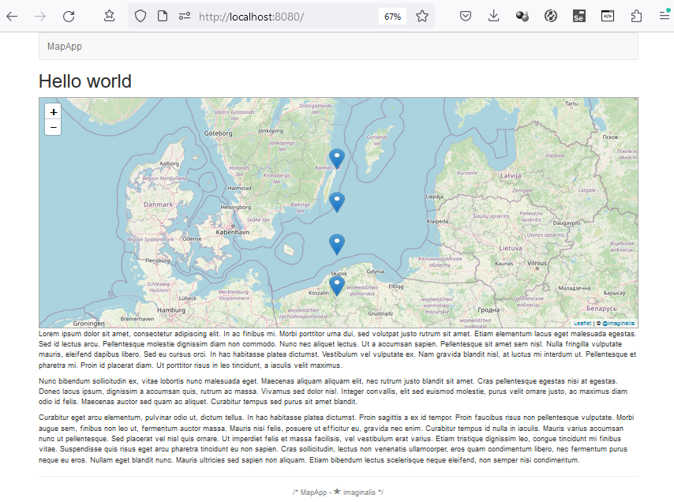

# Example map application

## overview
This example application is designed to show how spring-boot can be used to create a simple web application with a map and points.



This example will give you insights and a starting point for most of the things you will need to do in your group project

Features:
1. Spring MVC used with JSP to initialise map
1. [leaflet javascript library](https://leafletjs.com/) used to render points on the map 
1. Spring Rest Controller to provide ReST api for data points used by leaflet
1. Swagger/OpenAPI used to document the ReST api
1. Spring data JPA used to store data in a database
1. In memory HSQL database used - but can be replaced with external MYSQL by changing properties file
1. docker-compose used to run example in a docker jetty container
1. cargo-maven plugin used to deploy example to a remote jetty container with cargo jetty app installed

## reference tutorials

Very simple spring mvc JSP tutorial / example https://www.java4coding.com/contents/spring/spring-mvc-example

simple spring ReST example / tutorial https://spring.io/guides/tutorials/rest/   Building REST services with Spring

Spring Rest OpenAPI documentation https://www.baeldung.com/spring-rest-openapi-documentation

Docker-jetty-cargo - https://github.com/mthenw/docker-jetty-cargo/  Note my example is simpler and uses existing jetty container

Deploying Web Applications in Jetty  https://www.baeldung.com/deploy-to-jetty 

## details
InteractiveMapSpringBoot

Example Interactive map web app based on Spring Boot and leaflet with JSP

This example is inspired by the example at 

https://github.com/imaginalis/spring-boot-leaflet-starter

with the following changes:

1. migrated to spring 5
1. moved from leaflet to JSP
1. data changed to use HSQLDB and not mysql for testing
1. added openapi annotations

## to run locally

```
mvn clean install

mvn spring-boot:run
```

UI is at http://localhost:8080/


## open api annotations

Swagger / OpenAPI Test UI:

http://localhost:8080/swagger-ui/index.html

Swagger / OpenAPI yaml:

http://localhost:8080/api-docs

## to run in docker

```
docker-compose up
```

## to run in a remote docker

```
docker-compose -f docker-compose-deploy.yml build
docker-compose -f docker-compose-deploy.yml up -d
```
This Docker-compose script builds a jetty image using the referenced Dockerfile before running it. 
The Dockerfile adds the [jetty cargo remote deployer app](https://codehaus-cargo.github.io/cargo/Jetty+Remote+Deployer.html) to thestandard jetty image.

if the cargo app is deployed you will get a command unknown repsonse from http://localhost:8080/cargo-jetty-deployer/

You can then deploy the application to a remote jetty using the cargo configuration in the pom

```
mvn clean install

mvn cargo:deploy

mvn cargo:undeploy
```

If you deploy the app it will show up at http://localhost:8080/


Note that you probably need to go further and secure the deployer using authentication and https (behind a proxy)
